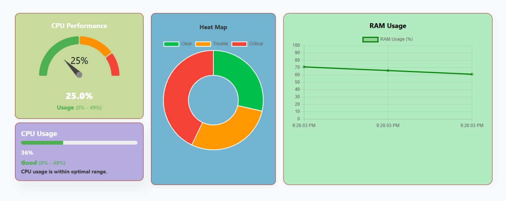

 # 🖥️ Server Monitoring Dashboard

A full-stack web-based application to monitor server health, resource usage, and system status in real-time. This project demonstrates **modular architecture**, **code optimization**, **professional frontend UI**, and **best practices** in API and database design.

---

## 🔧 Tech Stack

- **Frontend:** React.js, Chart.js, CSS (professional white theme), Responsive UI  
- **Backend:** Python Flask, PostgreSQL, SQLAlchemy ORM  
- **Other:** `.env` for sensitive configurations, RESTful APIs, Modular structure

---

## 📊 Features

- **Real-Time Metrics:**  
  RAM and CPU usage shown with intuitive gauges and color-coded insights.

- **Server Table:**  
  Clean and dynamic table listing each server with name, IP, location, status, and timestamps.

- **CPU Usage Insight:**  
  Circular usage indicator with animated feedback, descriptive text status (Good/Warning/Critical), and range-based color coding.

- **Professional UI:**  
  Polished white-themed dashboard layout with well-proportioned components and clean animations for a modern experience.

  

- **Backend Design:**  
  Optimized, modular Flask app using SQLAlchemy for ORM, environment-based config, and fully RESTful endpoints.

---
## 📸 Screenshots

### 🖥️ Full Dashboard View

---------

<h3>🎬 Dashboard Preview (Video)</h3>

<video width="100%" controls>
  <source src="./Dashboard.mp4" type="video/mp4">
  Your browser does not support the video tag.
</video>
---

## 🧠 Code Design Principles Followed

✅ **Code Optimization:** Reusable components, DRY structure, minimal redundancy  
✅ **Modularization:** Separated frontend modules (components) and backend (routes, models, config)  
✅ **Database Best Practices:** Normalized tables (`servers`, `metrics`, `alerts`) with clean relationships  
✅ **API Development:** RESTful endpoints, consistent HTTP status codes, and structured responses  
✅ **Environment-Based Configuration:** Secure use of `.env` for all sensitive values

---

## 🛢️ Database Schema

Includes:
- `servers`: Tracks each server's name, IP, location, status, created_at  
- `metrics`: Tracks RAM/CPU usage over time for each server  
- `alerts`: Can be extended for threshold-based event alerts

---

